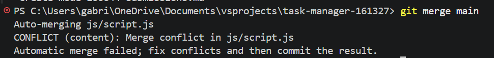
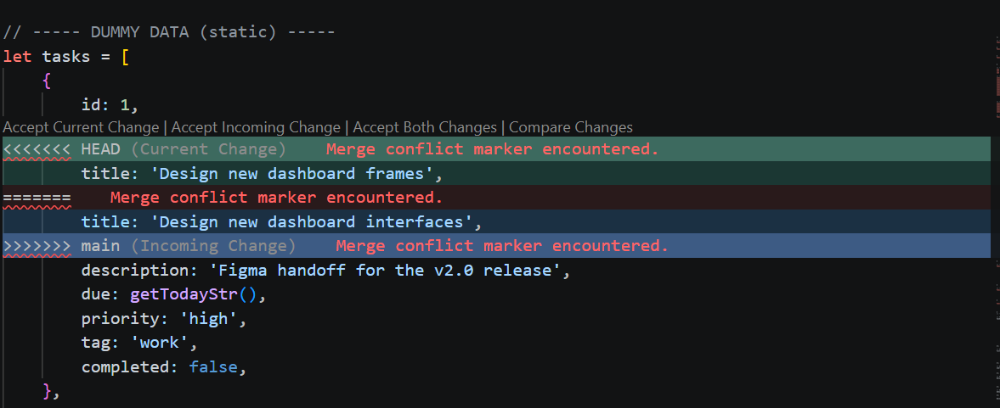

# Project Submission Report

## 1. Student Details

* **Full Name:** Gabriel Leon
* **GitHub Username:** Gibitoleon
* **Email:** Gabriel.Otieno@strathmore.edu

---

## 2. Deployed Portfolio Link

* **Live GitHub Pages URL:** https://is-project-2026.github.io/task-manager-161327/

---

## 3. Learnings from the Git Crash Program

### Concept 1: Feature Branch Workflow

* **How it helped me:** I learned to develop every feature on its own branch instead of working directly on the `main` branch. For example, I created separate branches such as `feat/4-add-task-functionality` and `feat/5-edit-task-functionality`, allowing me to work independently on each feature while keeping the `main` branch stable and always ready for deployment.

### Concept 2: Pull Requests

* **How it helped me:** I learned that Pull Requests are not just for team collaboration but also for reviewing my own work before merging it into `main`. After completing each feature, I opened a Pull Request, reviewed the changes on GitHub, and then merged it. Linking Pull Requests to issues also improved traceability throughout the project.

### Concept 3: Conventional Commits

* **How it helped me:** I learned to write meaningful commit messages using the Conventional Commits specification. Instead of generic messages such as "updated files," I used commits like `feat(tasks): add task creation functionality` and `docs(readme): update project documentation`, making my Git history easier to understand and audit.

### Concept 4: Merge Conflict Resolution

* **How it helped me:** I learned how merge conflicts occur when two branches modify the same section of code. During this project, I intentionally created a conflict between two feature branches, resolved the conflict using the conflict markers (`<<<<<<<`, `=======`, and `>>>>>>>`) in Visual Studio Code, committed the resolution, and successfully merged the changes. This gave me practical experience in handling conflicts that commonly occur during collaborative development.

## 4. Screenshots of Key GitHub Features

### A. Milestones and Issues

**Caption:** The **Task Management Features** milestone organized the application's core features into separate GitHub issues for adding, editing, deleting, and marking tasks as completed, making development progress easy to track.

---

### B. Project Board

**Caption:** GitHub Project Board demonstrating task progression across the To Do, In Progress, and Done columns.

---

### C. Branching Architecture

**Caption:** The project followed an issue-based branching strategy, where each feature and documentation task was developed in its own branch using conventional naming patterns such as `feat/`, `style/`, `docs/`, and `chore/` before being merged into the `main` branch through Pull Requests.

---

### D. Pull Requests & Traceability

**Caption:** This Pull Request implements the **Delete Task Functionality** feature and is linked to **Issue #6** using the `Closes #6` keyword. This demonstrates traceability from issue creation, feature development, and Pull Request review to the final merge into the `main` branch.

---

## 5. The Merge Conflict Chronology

### Step 1: Generating the Clash

**Caption:** A merge conflict occurred when the `feat/7-mark-task-completed` branch attempted to merge the latest changes from the `main` branch. Both branches contained different modifications to the same line in `js/script.js`, specifically the task title field in the dummy task data. Git detected the conflicting changes and stopped the merge process, requiring manual conflict resolution.

---

### Step 2: Inside the Code Editor (Native Conflict Markers)

- **Caption:** Visual conflict markers inside Visual Studio Code showing the competing changes before resolving the conflict. The final version was selected after reviewing both implementations to preserve the intended functionality.

---

### Step 3: Resolution & Clean Merge Log

-  **Caption:** The merge conflict was successfully resolved by preserving the `main` branch version containing the dashboard interface implementation. The final unified `js/script.js` file was merged successfully, maintaining the intended application functionality on the `main` branch.