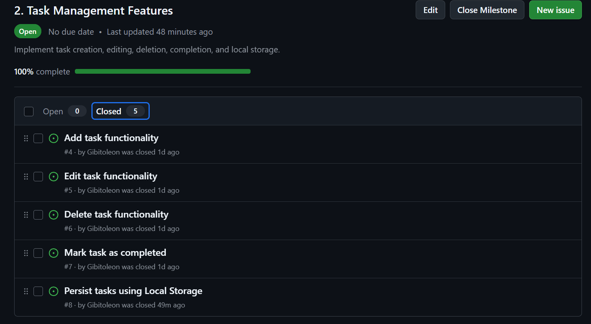
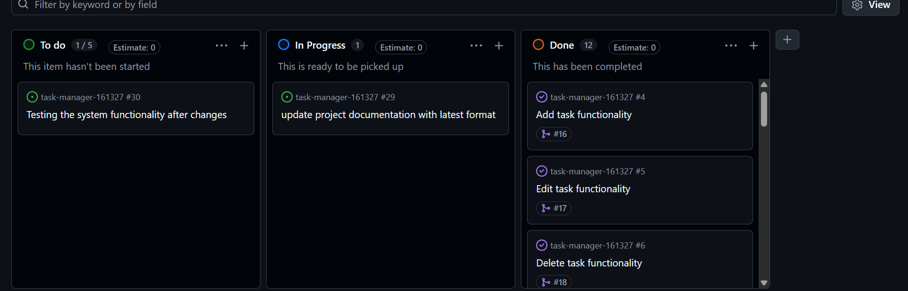
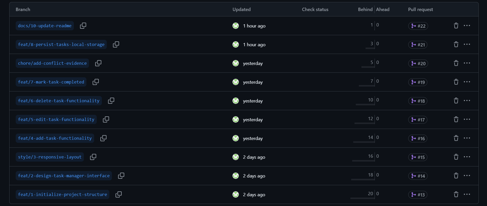
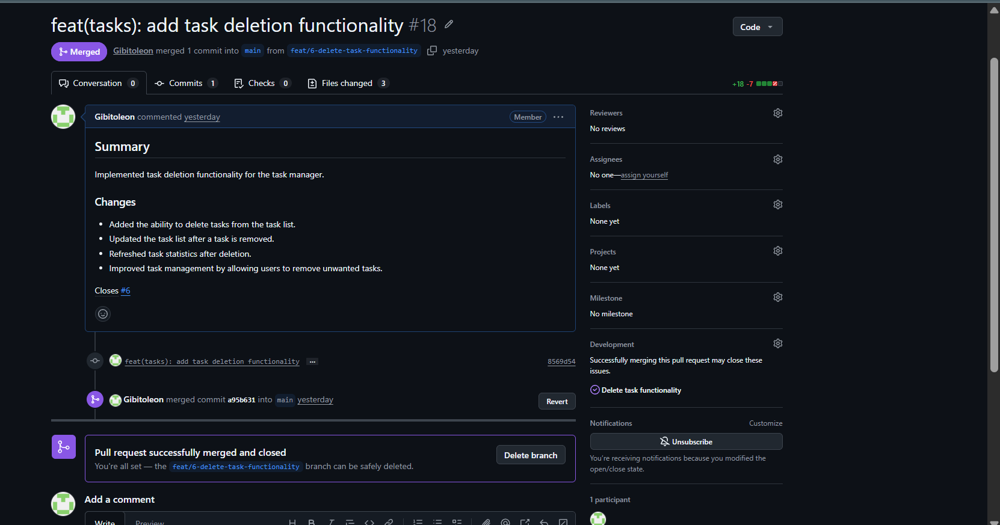
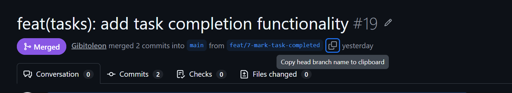
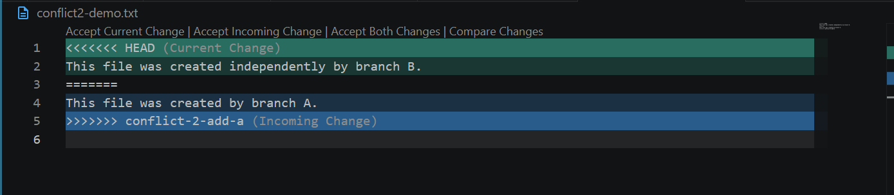
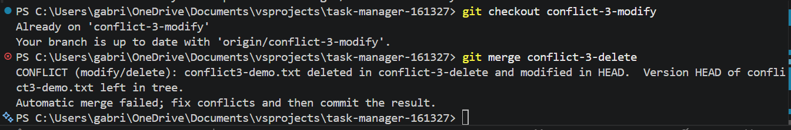

# Project Submission Report

## 1. Student Details

* **Full Name:** Gabriel Leon
* **GitHub Username:** Gibitoleon
* **Email:** Gabriel.Otieno@strathmore.edu

---

## 2. Deployed Portfolio Link

* **Live GitHub Pages URL:** https://is-project-2026.github.io/task-manager-161327/

---

## 3. Reflection 

### A. Your Best Commit

* **Commit URL:** https://github.com/IS-PROJECT-2026/task-manager-161327/commit/0292fa9d731fbd606511c7650bba4727cc2500bc

* **Why this one?** This commit stands out to me because it uses the `style(ui)` Conventional Commit type, which was something I had not encountered before this project. It helped me understand that Conventional Commits are not limited to `feat` and `fix`, but can also communicate more specific types of changes, such as styling changes to the user interface.

### B. A Mistake or Struggle

* **Link to the evidence:** [https://github.com/IS-PROJECT-2026/task-manager-161327/issues/9]

* What happened and how did you recover? My main struggle was understanding the practical purpose of connecting the feature-branch and Pull Request workflow to main before the application had reached a usable MVP. I questioned whether main should be deployed early when there was not yet a meaningful system to deploy, while keeping main undeployed made the purpose of the workflow less obvious to me.This was primarily a workflow dilemma rather than a technical mistake, and it shaped my understanding of how I would structure a similar project in the future.

### C. A Pull Request  Proud Of

* **PR URL:** https://github.com/IS-PROJECT-2026/task-manager-161327/pull/15

* **What did you check before merging?** I reviewed the Pull Request diff to verify that the responsive layout changes were limited to the intended UI work and that the changes were consistent with the existing project structure. I also reviewed the PR and its associated branch before merging it into `main`, giving me an opportunity to self-review the implementation through the GitHub Pull Request workflow.

### D. One Thing I Would Do Differently

* **What would you change?** If I were starting the project again, I would define the MVP boundary earlier and establish the GitHub Pages deployment immediately after reaching that MVP. This would give `main` a clear role as the stable, deployed version of the application while feature branches and Pull Requests would represent controlled changes to that live system.

* **Link to the evidence of the original decision:** [https://github.com/IS-PROJECT-2026/task-manager-161327/issues/9]

## 4. Screenshots of Key GitHub Features

### A. Milestones and Issues

**Caption:** The **Task Management Features** milestone organized the application's core features into separate GitHub issues for adding, editing, deleting, and marking tasks as completed, making development progress easy to track.

---

### B. Project Board

**Caption:** GitHub Project Board demonstrating task progression across the To Do, In Progress, and Done columns. Most of the task has being completed at this particular point in time but two remained one in progress as the submissions file was being updated and  the  one  in the to be done stage as the live system was to be tested  again if it were live because  some changes were m,ade

---

### C. Branching Architecture

**Caption:** The project followed an issue-based branching strategy, where each feature and documentation task was developed in its own branch using conventional naming patterns such as `feat/`, `style/`, `docs/`, and `chore/` before being merged into the `main` branch through Pull Requests.

---

### D. Pull Requests & Traceability

**Caption:** This Pull Request implements the **Delete Task Functionality** feature and is linked to **Issue #6** using the `Closes #6` keyword. This demonstrates traceability from issue creation, feature development, and Pull Request review to the final merge into the `main` branch.

---

## 5. Merge Conflict Evidence

The project demonstrates three separate merge conflicts, each caused by a different Git merge scenario. Each conflict was intentionally engineered, resolved, and committed.

### Conflict 1 — Same Lines Modified Differently

**What cause did you use?** Same lines modified differently.

#### Step 1: Generating the Clash

* **Caption:** A merge conflict occurred when the `feat/7-mark-task-completed` branch attempted to merge changes from `main`. Both branches contained different modifications to the same line in `js/script.js`, specifically the task title field in the dummy task data. Git detected the conflicting changes and stopped the merge process, requiring manual conflict resolution.

---
#### Step 2: Inside the Code Editor (Native Conflict Markers)

* **Caption:** Visual Studio Code displayed the native Git conflict markers (`<<<<<<< HEAD`, `=======`, and `>>>>>>>`) showing the competing changes from the two branches. I reviewed the alternatives and selected the appropriate final version before completing the resolution.

---

#### Step 3: Resolution & Clean Merge

* **Caption:** The merge conflict was successfully resolved by preserving the main branch version containing the dashboard interface implementation. The final unified js/script.js file was merged successfully, maintaining the intended application functionality on the main branch.

---

**Why does this cause trigger a conflict?**

This was an add/add conflict because both branches independently created a file named conflict2-demo.txt from the same common starting point. Branch A created the file with the content “This file was created by branch A.”, while Branch B created the same file with the content “This file was created by branch B.” Git could not automatically determine which version of the newly added file should be retained, so it stopped the merge and required manual resolution.

**Caption**: The add/add conflict was generated when conflict-2-add-a was merged into conflict-2-add-b. Both branches had independently created conflict2-demo.txt with different contents. Git displayed the competing versions using conflict markers, allowing the conflict to be identified and manually resolved.

---

### Conflict 3 — Modify/Delete Conflict

**What cause did you use?** One branch modified a file while another branch deleted it.

**Branches:** `conflict-3-delete` and `conflict-3-modify`

**Why does this cause trigger a conflict?** `conflict-3-delete` deleted `conflict3-demo.txt`, while `conflict-3-modify` modified the same file. Git could not automatically determine whether the file should be deleted or retained, so it stopped the merge and required a manual resolution.

 
 

* **Caption:** Git reported a modify/delete conflict after `conflict-3-delete` was merged into `conflict-3-modify`. Unlike a content conflict, this was a file-operation conflict, so Git did not insert `<<<<<<<`, `=======`, and `>>>>>>>` markers into the file. I resolved the conflict by retaining the modified version and committed the resolution.
